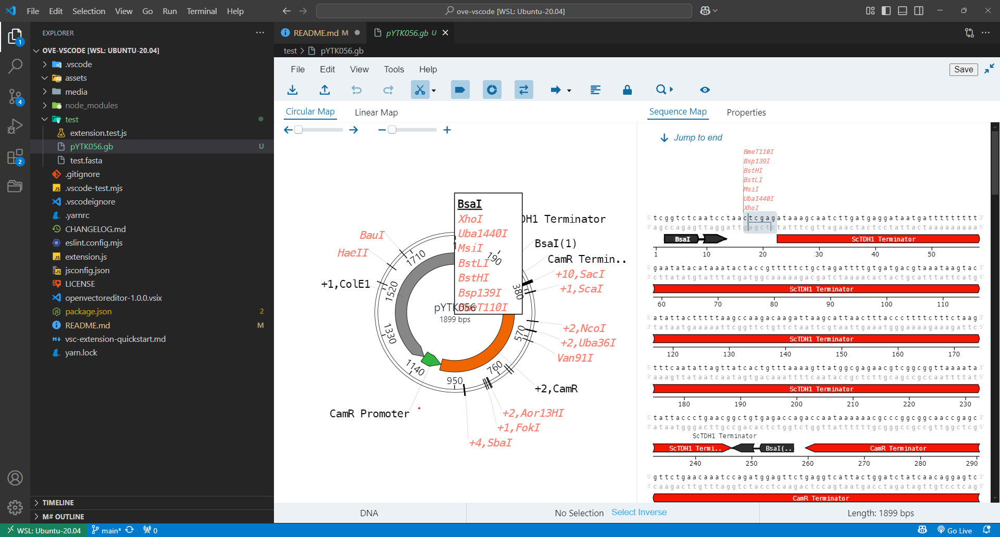
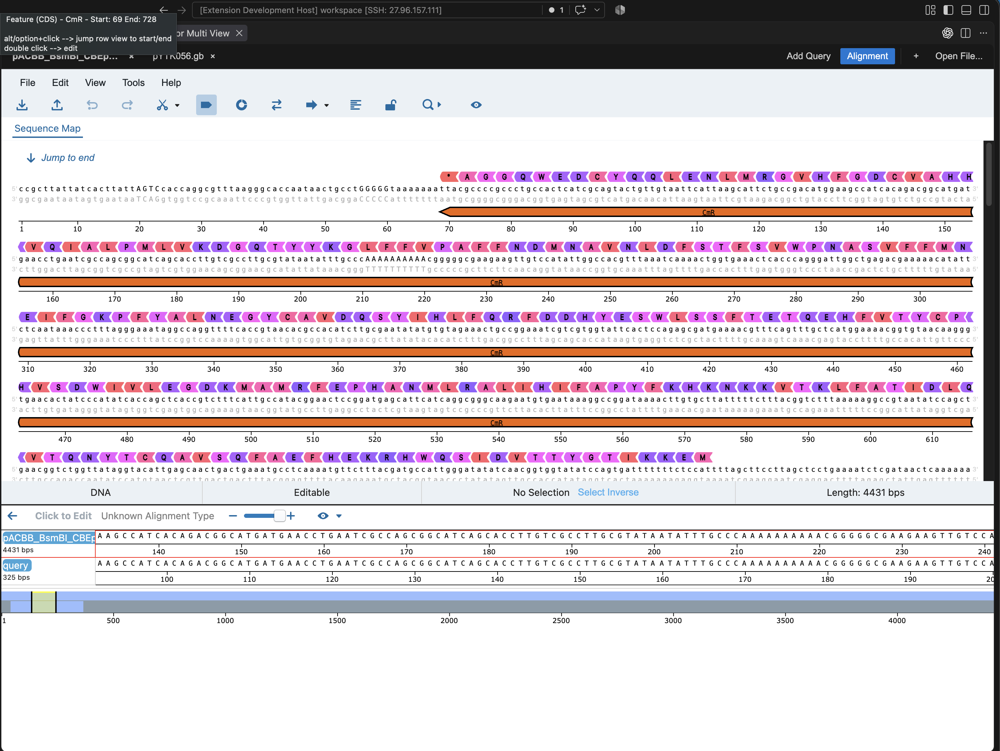

# openvectoreditor in vscode

Generate [openvectoreditor](https://github.com/TeselaGen/tg-oss/tree/master/packages/ove) webview when open dna format in vscode.

refer to ove (https://github.com/TeselaGen/tg-oss/tree/master/packages/ove)

## Installation

vscode-marketplace: https://marketplace.visualstudio.com/items?itemName=sanekun.openvectoreditor

vscode - tab menu - Extensions: Install from VSIX - select openvectoreditor-1.3.0.vsix

## Features

- tab menu: `openvectoreditor:show`: (Deprecated) open general ove (Can remain contents)
- tab menu: `openvectoreditor:multiview`: open Multi View — keep several sequences open as tabs in one panel, paste a sequence directly into a blank tab or open one from a file, and run a pairwise alignment ("Add Query") against whichever tab is active
- Support Read and Write: .dna, .fa, .fasta, .gb, .gbk format
- Select DNA File - Open With - select OVE (Can set as default)
- Save file with custom button (support all formats including .dna) — Multi View tabs are read-only/session-only and have no Save button
- Setting `openvectoreditor.defaultViewOptions`: choose which editor toggles (Read Only, Show Cut Sites, Show Features, Show Primers, Show Parts) start ON when a file or Multi View tab opens (default: Read Only, Show Features)

## Known Issues

data remaining
- When switching to another tab, the content does not persist.
- Only the editor opened via the command `openvectoreditor.show` retains its content.
- (Multi View has its own tabs and does persist content across tab switches within the panel, but not across closing/reopening the panel.)

## Release Notes

- refer to [Changelog](CHANGELOG.md)

### 1.3.0

- Update Multiview panel
- Add Pairwise Alignment feature
